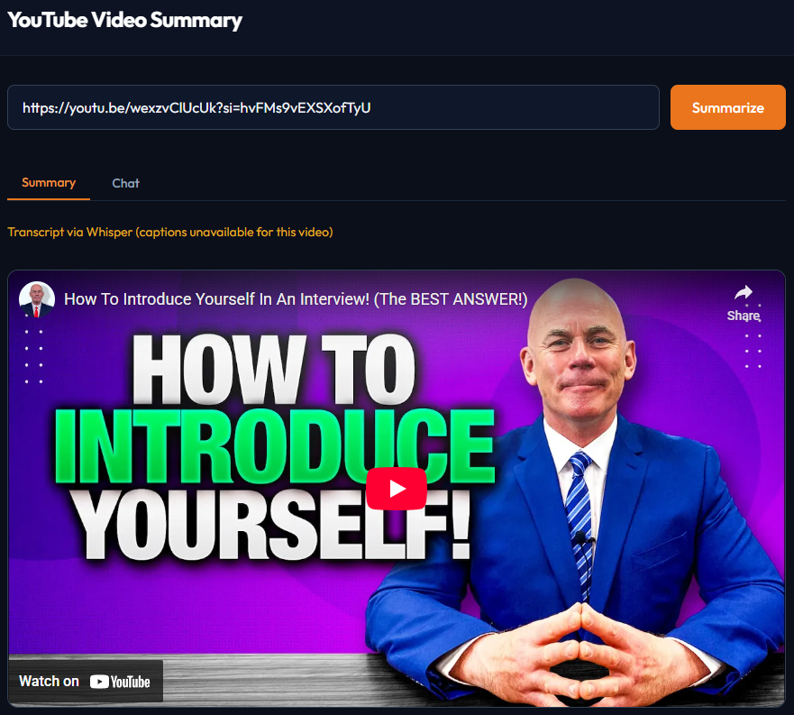
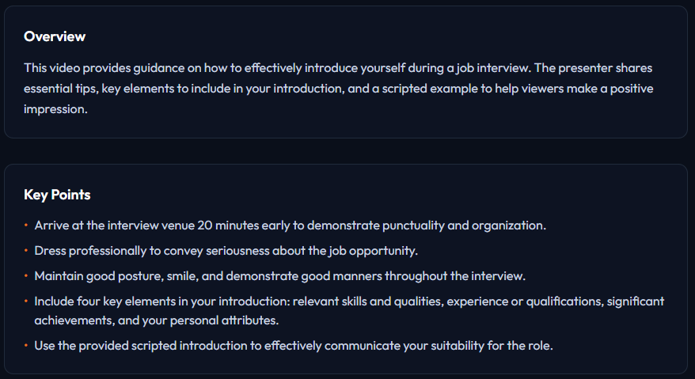
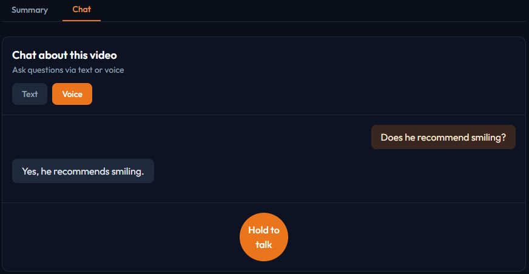

# YouTube Video Summary

A web app that summarizes YouTube videos (English only) with AI. Paste a URL to get a summary, key points, chapters, and chat about the video via text or voice.


## Screenshots

| Input & Video | Summary | Chat |
|---------------|---------|------|
|  |  |  |

## Features

| Feature | Description |
|---------|-------------|
| **Transcript Extraction** | Fetch captions from any YouTube video (no API key required) |
| **LLM Summarization** | GPT-4 powered overview, key points, and chapter detection |
| **Whisper Fallback** | When captions fail, download audio and transcribe with Whisper |
| **Text Chat** | Ask questions about the video and get contextual answers |
| **Voice Chat** | Speak your question → Whisper transcribes → LLM answers → TTS speaks |

## Tech Stack

- **Backend**: FastAPI, youtube-transcript-api, yt-dlp, OpenAI (GPT-4 + Whisper)
- **Frontend**: React 18, Vite, Tailwind CSS, Framer Motion
- **Voice**: Web Speech API (browser) + Whisper API (transcription) + Speech Synthesis (TTS)

## Run Locally

### Prerequisites

- **Python 3.11 or 3.12** ([download](https://www.python.org/downloads/))
- **Node.js** ([download](https://nodejs.org))
- **OpenAI API key** ([get one](https://platform.openai.com/api-keys))

### 1. Backend

```powershell
cd backend
py -3.12 -m venv .venv
.venv\Scripts\activate
pip install -r requirements.txt
```

Create a `.env` file in the `backend` folder:

```
OPENAI_API_KEY=sk-your-key-here
```

Start the server:

```powershell
uvicorn app.main:app --reload --port 8000 --reload-dir app
```

**macOS/Linux:**

```bash
cd backend
python3 -m venv .venv
source .venv/bin/activate
pip install -r requirements.txt
# Add OPENAI_API_KEY to .env
uvicorn app.main:app --reload --port 8000 --reload-dir app
```

### 2. Frontend (new terminal)

```powershell
cd frontend
npm install
npm run dev
```

### 3. Open the app

Visit **http://localhost:5173** and paste a YouTube URL.

---

**Troubleshooting**

- **PowerShell blocks activate script:** Run `Set-ExecutionPolicy -ExecutionPolicy RemoteSigned -Scope CurrentUser`
- **Python 3.14:** Use Python 3.11 or 3.12 (pydantic doesn't support 3.14 yet)
- **npm not found:** Install Node.js from nodejs.org
